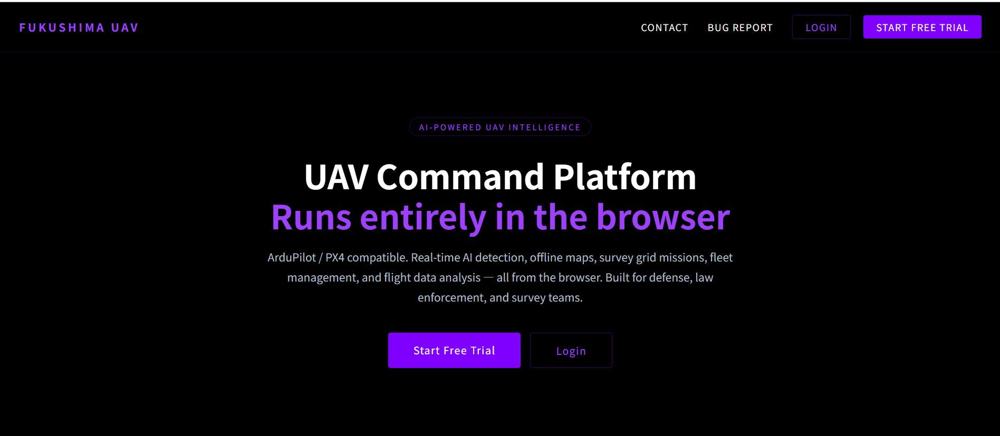
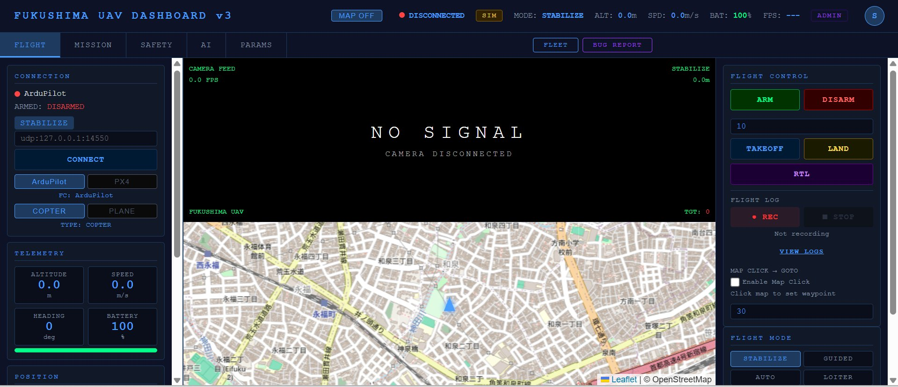
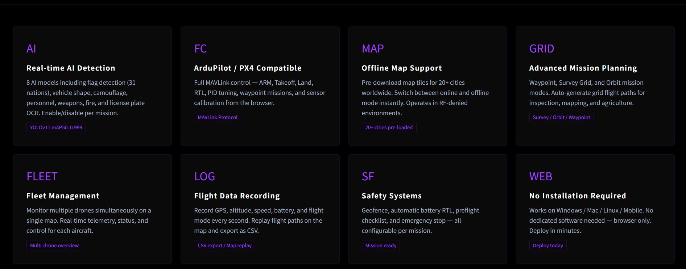

# FUKUSHIMA GK — AI-Powered UAV Ground Control Station

  

  <strong>Professional drone operations platform with real-time AI detection, fleet management, and mission planning.</strong>

  <a href="https://fukushima-gk.com">Live Demo</a> •
  <a href="#features">Features</a> •
  <a href="#ai-models">AI Models</a> •
  <a href="#pricing">Pricing</a> •
  <a href="#contact">Contact</a>

---

## Overview

**Fukushima GK** is a cloud-based Ground Control Station (GCS) for UAV / drone operations. It combines a real-time flight dashboard with onboard AI detection models, enabling operators to monitor, detect, and respond — all from a single browser interface.

Built for hobbyists, startups, law enforcement, and defense organizations.

---

## Features

### Real-Time AI Detection
Multiple ONNX-optimized detection models run directly on your drone's companion computer, providing instant alerts with bounding boxes and confidence scores.

### Offline Map Support
Operates in 20+ cities worldwide with pre-cached map tiles — no internet required in the field.

### Mission Planning
- **Waypoint** — Define flight paths with altitude, speed, and loiter time
- **Survey Grid** — Automated area coverage for mapping and inspection
- **Orbit** — Circular surveillance around a point of interest

### Fleet Management
Monitor multiple aircraft simultaneously on a single dashboard with live telemetry, status indicators, and position tracking.

### Flight Logs
Full flight history with CSV export, altitude/speed graphs, and timeline visualization.

### Parameter Tuning
Read and write PID parameters directly from the dashboard. Supports both COPTER and PLANE frame types.

### Subscription Management
Self-service plan selection, PayPal billing, coupon support, and real-time MRR tracking for operators.

---

## AI Models

| Model | Description | Availability |
|---|---|---|
| Basic Detection | People, vehicles, objects | Startup+ |
| Collision Avoidance | Obstacle detection for autonomous flight | Startup+ |
| Weapon Detection | Firearm and weapon identification | Police+ |
| Fire Detection | Flame and fire source detection | Police+ |
| Smoke Detection | Smoke plume identification | Police+ |
| License Plate | Vehicle plate recognition | Police+ |
| Aircraft Detection | Aerial vehicle identification | Police+ |
| Flag Recognition | 31-nation flag classification | Defense |
| Vehicle Shape | Military/civilian vehicle classification | Defense |
| Camo Pattern | Camouflage pattern detection | Defense |
| Boat Detection | Maritime vessel detection | Coming Soon |
| Crowd Detection | Crowd density estimation | Coming Soon |

All models are exported to ONNX for optimized edge deployment.

---

## Pricing

| Plan | Price | Included Models |
|---|---|---|
| **Hobby** | $10/mo | Dashboard, Maps, Flight Logs, Mission Planning |
| **Startup** | $300/mo | + Basic Detection, Collision Avoidance |
| **Police** | $3,000/mo | + Weapon, Fire, Smoke, License Plate, Aircraft |
| **Defense** | $5,000/mo | All models including Flag, Vehicle Shape, Camo |

All plans include a **free trial period**. Custom enterprise pricing available on request.

---

## Screenshots

  

  
  &nbsp;&nbsp;
  

---

## Tech Stack

- **Backend:** Python / Flask
- **Frontend:** HTML, CSS, JavaScript, Leaflet.js
- **AI:** ONNX Runtime
- **Payments:** PayPal Subscriptions API
- **Infrastructure:** Ubuntu VPS (Tokyo region)

---

